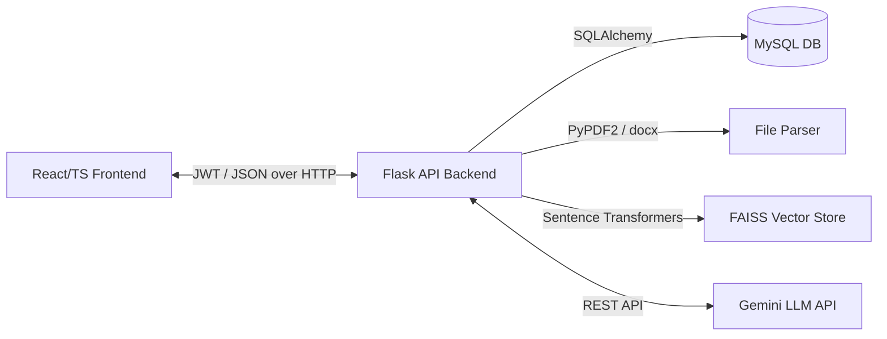

# System Architecture

## 1. High-Level System Diagram

## 2. Backend Layered Architecture
The backend is built in **Python 3.8.10** using **Flask** and follows a strict App Factory and Layered Controller-Service pattern to separate routing from business logic.

- **`app/routes/`**: Handles endpoint definitions, blueprint registrations, and attaches the `@token_required` authentication middleware.
- **`app/controllers/`**: Extracts the HTTP request payloads, triggers schema validation, delegates business logic to the service layer, and returns standardized `success_response` or `error_response` envelopes.
- **`app/validations/`**: Utilizes Marshmallow schemas to validate incoming JSON structures before processing begins.
- **`app/services/`**: The core business logic layer. Handles database queries, orchestrates AI processes, and manages entity relationships.
- **`app/models/`**: SQLAlchemy declarative models defining `User`, `Resume`, `JobDescription`, and `Analysis` structures mapping to the MySQL database. The `Analysis` model now includes expanded schema columns (e.g. `ats_score`, `missing_sections`, `has_email`, `has_phone`, `has_dates`, `quantification_ratio`, `word_count`, `length_flag`, `suggested_resources`, `improvement_summary`).
- **`app/utils/`**: Shared helper functions such as the FAISS `VectorStore`, `skill_detector`, `ai_feedback` (Gemini API wrapper), `embedding_utils` (SentenceTransformer Singleton), `ats_checker.py` (Rule-based parsability checker), `skill_resources.py` (Static targeted certification map), and `improvement_prioritizer.py` (Deterministic logic extracting priority lists).

## 3. Frontend Architecture
The frontend is built with **React**, **TypeScript**, and **Vite**, utilizing **SCSS Modules** for scoped styling.

- **`components/`**: Reusable generic UI components (e.g., `Button`, `TextInput`, `ScoreGauge`, `SkillTag`, `Toast`) independent of business logic.
- **`pages/`**: View-level aggregations connecting components to layouts and passing fetched data (e.g., `DashboardPage`, `UploadResumePage`, `AnalysisDetailPage`).
- **`layouts/`**: Wrappers dictating structure (e.g., `Sidebar`, `Header`, `MainLayout`, `AuthLayout`).
- **`services/`**: Centralized Axios API clients (`apiClient.ts`, `authService.ts`, `analysisService.ts`) preventing stray API calls inside React components.
- **`context/`**: Global state management including `AuthContext` (JWT session lifting) and `ThemeContext` (Light/Dark mode).
- **`types/`**: Strict TypeScript interfaces mapping identically to the backend database models and HTTP response shapes.

## 4. Core Data Flow (Analysis Execution)
1. **Initiation**: Client calls `POST /api/analyses` with a `resume_id` and `job_description_id`.
2. **Entity Hydration**: `analysis_service` verifies ownership and loads the `Resume` (containing `extracted_text`) and `JobDescription`.
3. **Embedding Generation**: The Resume text is chunked and passed to the local `sentence-transformers` Singleton model to generate vector embeddings.
4. **Vector Retrieval**: The embeddings are loaded into a transient, in-memory FAISS index. The Job Description is embedded and searched against the index to find the Top-K relevant resume chunks.
5. **Skill Matcher**: Explicit Regex boundaries sweep both documents for exact hits against an predefined IT/Business skill dictionary.
6. **ATS Structure Check**: The resume text is routed securely through non-LLM based structural parsing checking contact info, dates, and outcome quantifications.
7. **Targeted Certifications**: Deficient identified skills bypass to deterministic mapping to assign well-known and validated course recommendations.
8. **Improvement Prioritizer**: Analysis data is compiled into a weighted algorithm identifying the Top 5 most critical problems needing resolution.
9. **LLM Synthesis**: The Top-K chunks, match score, and skill gaps are fed into the Google Gemini LLM API to generate conversational feedback and recommendations.
10. **Storage & Serialization**: The resulting analysis is committed to the MySQL DB and returned to the frontend.

## 5. Authentication Flow
- The application uses stateless **JSON Web Tokens (JWT)**.
- On login, the backend verifies credentials, generates a JWT (signed via `SECRET_KEY`), and returns it to the client.
- The frontend stores the JWT in `localStorage` securely hydrating the `AuthContext`.
- The Axios interceptor (`apiClient.ts`) attaches `Bearer <token>` to all secure requests.
- Protected Routes (Frontend) and `@token_required` (Backend) block unauthenticated access. 401 unauthenticated errors trigger an immediate context purge and redirect to `/login`.

## 6. Deployment Architecture
- **Frontend App**: Vercel (or Netlify/Cloudflare Pages), taking advantage of static asset delivery and edge caching.
- **Backend API**: Render (or equivalent Docker container service), served production-ready using `gunicorn`.
- **Database**: Managed MySQL (e.g., PlanetScale, AWS RDS, DigitalOcean).
- **Environment**: Keys managed via `.env` files locally and secure configuration variables in the cloud.
